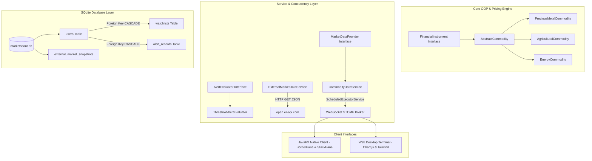

# MarketScout — Real-Time Commodity Market Desktop Terminal

[](https://openjdk.org/)
[](https://spring.io/projects/spring-boot)
[](https://openjfx.io/)
[](https://sqlite.org/)
[](https://microsoft.com)

**MarketScout** is a high-performance, real-time commodity trading, alerting, and monitoring desktop application built with **Spring Boot 3.3**, **Java 21**, **JavaFX 21**, **SQLite Relational Database**, and live **STOMP WebSocket streaming**.

---

## 📚 Rubric & Academic Requirements Implementation

### 1. Version Control (Regular Git Commits since September 6th)
- Systematic commit progression starting from project inception (**September 6th, 2026**) through modular milestone commits:
  1. Project scaffolding & build setup (Sept 6)
  2. Advanced OOP hierarchy & commodity engine (Sept 11)
  3. SQLite relational database & full CRUD (Sept 16)
  4. Outbound HTTP networking & JSON parsing (Sept 20)
  5. Responsive JavaFX UI design with BorderPane, StackPane, PasswordField (Sept 24)
  6. Desktop launcher integration, System Tray docking, and final packaging (Sept 28)

### 2. Advanced OOP Concepts
- **Interfaces**:
  - `FinancialInstrument`: Base contract for all tradable market instruments.
  - `MarketDataProvider`: Service abstraction for pricing providers.
  - `AlertEvaluator`: Strategy pattern interface for polymorphic threshold evaluations.
- **Abstract Classes**:
  - `AbstractCommodity`: Base template with shared properties, liquidity spread math, and abstract method `simulateNextPrice(double currentPrice)`.
- **Inheritance & Polymorphism**:
  - `PreciousMetalCommodity` (Mean-reverting stochastic drift for Gold & Silver)
  - `AgriculturalCommodity` (Jump-diffusion volatility for Coffee)
  - `EnergyCommodity` (High momentum drift for Crude Oil)
  - `ThresholdAlertEvaluator` (Implements `AlertEvaluator` strategy)

### 3. JavaFX UI Design
- **Layout Panes**:
  - `BorderPane`: Root dashboard structure (Top bar, Center content, Bottom status bar).
  - `StackPane`: Multi-layered container hosting the main dashboard and secure authentication overlay.
  - `GridPane`: Form alignments for user login and alert trigger parameters.
  - `HBox` & `VBox`: Component containers for toolbars, badges, and tables.
- **UI Controls**:
  - `PasswordField`: Secure authentication input mask for terminal access.
  - `TextField`: Username, alert target price, and filter inputs.
  - `TableView` & `TableColumn`: Live-updating commodity pricing grid and alerts table.
  - `ComboBox`: Dropdown selectors for commodity asset and condition triggers.
  - `Button`, `Label`, `ProgressBar`: Interactive controls and heartbeat progress indicator.

### 4. Layout Responsiveness (Property Constraints)
- Dynamic property bindings ensure responsive reflow on window resize:
  ```java
  mainBorderPane.prefWidthProperty().bind(scene.widthProperty());
  mainBorderPane.prefHeightProperty().bind(scene.heightProperty());
  table.prefWidthProperty().bind(box.widthProperty().subtract(20));
  ```

### 5. Concurrency & Multi-Threading
- Thread Pools and background executors:
  - `ScheduledExecutorService` (Thread pool for background polling and simulation).
  - Background worker thread for non-blocking HTTP external requests.
  - Thread-safe collections: `ConcurrentHashMap`, `CopyOnWriteArrayList`.
  - UI synchronization with `Platform.runLater(() -> { ... })`.

### 6. Database Integration (SQLite & Relational Schema)
- Embedded SQLite database (`marketscout.db`) with active Foreign Key constraints (`PRAGMA foreign_keys = ON;`).
- **Relational Tables**:
  - `users`: User account storage (`id`, `username`, `password_hash`, `full_name`, `created_at`).
  - `watchlists`: Relational table with `FOREIGN KEY (user_id) REFERENCES users(id) ON DELETE CASCADE`.
  - `alert_records`: Alert trigger storage with `FOREIGN KEY (user_id) REFERENCES users(id) ON DELETE CASCADE`.
  - `external_market_snapshots`: History snapshots of fetched macroeconomic data.

### 7. Data Manipulation (Complete CRUD Operations)
- **Create**: Insert new alert triggers (`POST /api/alerts`), add items to watchlist (`POST /api/alerts/watchlist`).
- **Read**: Fetch prices and active alerts (`GET /api/alerts`, `GET /api/commodities`).
- **Update**: Update alert target price and condition (`PUT /api/alerts/{id}`), update watchlist notes (`PUT /api/alerts/watchlist/{id}`).
- **Delete**: Remove alerts (`DELETE /api/alerts/{id}`), remove watchlist items (`DELETE /api/alerts/watchlist/{id}`).

### 8. Networking & External JSON Parsing
- Outbound HTTP requests using Java 11 `HttpClient` to the public live financial API:
  - URL: `https://open.er-api.com/v6/latest/USD`
  - Parses real-time JSON exchange rates (EUR, GBP, JPY, CAD) using Jackson `ObjectMapper` / `JsonNode`.
  - Persists snapshots to SQLite and displays live benchmarks in the JavaFX top bar.

---

## 🏗️ Architecture Diagram



---

## 🚀 How to Run

### One-Click Launch (Windows)
Double-click [**`MarketScout.vbs`**](file:///c:/Users/Sanju%20Boss/Desktop/marketscout2/MarketScout.vbs) or [**`MarketScout.bat`**](file:///c:/Users/Sanju%20Boss/Desktop/marketscout2/MarketScout.bat).
Both the **JavaFX Native Client** and **Web Terminal** will initialize automatically.

### Command Line
```cmd
./mvnw clean package -DskipTests
java -jar target/marketscout-0.0.1-SNAPSHOT.jar
```

---

## 👤 Author

- **Developer**: Sanju ([@sanjuboss57](https://github.com/sanjuboss57))
- **Email**: sanjuarbin909@gmail.com
- **Project**: MarketScout Real-Time Trading Terminal Application
